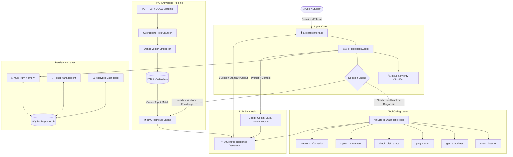

# 🖥️ AI IT Helpdesk Agent
### Intelligent Campus IT Troubleshooting Powered by AI Agents, RAG & Live Diagnostics

[](https://www.python.org/downloads/)
[](https://streamlit.io/)
[](https://github.com/facebookresearch/faiss)
[](https://aistudio.google.com/)
[](https://opensource.org/licenses/MIT)

---

## 📌 Executive Summary & Project Objective
In high-density academic and institutional environments (universities, colleges, corporate workplaces), IT support desks face hundreds of repetitive daily tickets ranging from network connectivity failures to software dependency crashes and password lockouts.

**AI IT Helpdesk Agent** is an enterprise-grade AI technical support system. Unlike basic chatbots that merely hallucinate generic text, this agent combines:
1. **AI Agent Orchestration**: Multi-stage reasoning that categorizes issues and decides between live machine diagnostics, institutional knowledge retrieval, or support ticket escalation.
2. **Retrieval-Augmented Generation (RAG)**: Indexes university IT manuals, network guides, software policies, and printer documentation using FAISS vector search.
3. **Safe IT Diagnostic Tools**: Predefined, read-only system and network inspection tools that test internet connectivity, resolve IP addresses, ping hosts, examine disk quotas, and inspect hardware.
4. **Conversation Memory & SQLite Persistence**: Multi-turn contextual continuity and complete support ticketing lifecycle tracking.
5. **Modern Interactive Dashboard**: Analytics on issue distributions, ticket resolution status, and active queries.

---

## 🏗️ System Architecture



---

## 📂 Project Folder Structure

```
AI-IT-Helpdesk-Agent/
├── app.py                     # Streamlit Main App & Helpdesk Chat View
├── config.py                  # Environment paths, models, taxonomies, and colors
├── agent.py                   # Multi-stage AI Agent (Intent, Tools, RAG, Gemini synthesis)
├── rag.py                     # RAG Engine (PDF/TXT extraction, chunking, FAISS vector index)
├── memory.py                  # Multi-turn conversation memory with SQLite synchronization
├── database.py                # SQLite database management (Conversations, Tickets, Docs)
├── tools.py                   # 6 Safe IT Diagnostic Tools with command injection prevention
├── prompts.py                 # Structured system instructions, classifiers, synthesis prompts
├── requirements.txt           # Clean dependencies list
├── .env.example               # Template for Gemini API key
├── .gitignore                 # Excludes caches, databases, and vector stores
├── README.md                  # Complete documentation and viva guide
│
├── knowledge_base/            # Initial institutional IT guides
│   ├── sample_it_guide.pdf    # Multi-page Campus IT Operating Procedures Manual
│   ├── network_guide.txt      # Wi-Fi, DNS, Gateway, DHCP troubleshooting
│   ├── windows_guide.txt      # Windows boot, crashes, BSOD, update fixes
│   ├── printer_guide.txt      # Offline printer, print spooler, driver fixes
│   ├── software_guide.txt     # MATLAB, Office 365, VC++ runtime licensing
│   └── account_security.txt   # Password reset, account lockout, 2FA procedures
│
├── vectorstore/               # FAISS vector database & metadata storage
├── data/                      # SQLite database storage (helpdesk.db)
│
├── pages/                     # Streamlit multi-page interface
│   ├── dashboard.py           # Live operational metrics, charts, and resolution logs
│   ├── knowledge_base.py      # Document upload, chunk viewer, RAG search sandbox
│   └── tickets.py             # Support ticket creation, filters, and status management
│
└── utils/
    └── helpers.py             # IT support blue/white UI theme, badge pills, cards
```

---

## ⚙️ Technology Stack

| Component | Technology | Purpose |
| :--- | :--- | :--- |
| **Language** | Python 3.11+ | Core application logic |
| **Frontend UI** | Streamlit | Responsive web UI with chat bubbles and multi-page routing |
| **Styling** | Custom Vanilla CSS | Enterprise IT-support blue/white aesthetics, glowing badges |
| **Orchestration** | Python Agent Pipeline | Intent routing, tool dispatch, and prompt synthesis |
| **LLM Engine** | Google Gemini API | `gemini-2.5-flash`, `gemini-1.5-flash` with offline fallback |
| **Vector DB** | FAISS (`faiss-cpu`) | High-speed inner-product cosine similarity vector search |
| **Embeddings** | Dense Semantic Embeddings | Normalized subword/TF-IDF & Sentence-Transformers |
| **Document Parser** | `pypdf`, `reportlab` | Multi-page PDF text extraction and documentation building |
| **Database** | SQLite 3 | Embedded zero-configuration persistence for tickets & history |
| **Charts** | Altair & Pandas | Interactive bar charts and ticket distribution metrics |

---

## 🚀 Quick Start & Installation

### Step 1: Clone or Open the Workspace
Open a terminal in the project directory:
```bash
cd AI-IT-Helpdesk-Agent
```

### Step 2: Install Required Dependencies
```bash
pip install -r requirements.txt
```

### Step 3: Configure Environment Variables (Optional)
Copy `.env.example` to `.env`:
```bash
cp .env.example .env
```
Open `.env` and insert your Gemini API Key:
```env
GOOGLE_API_KEY=AIzaSyYourActualApiKeyHere
GEMINI_MODEL=gemini-2.5-flash
```
*(Note: If you do not have an API key, the application automatically runs in **Demonstration Mode** with intelligent rule-based synthesis + live diagnostics + RAG, so it never crashes!)*

### Step 4: Run Automated Verification Tests
Verify all system modules before starting:
```bash
python test_system.py
```

### Step 5: Launch the Web Application
```bash
streamlit run app.py
```
The browser will automatically open at: **`http://localhost:8501`**

---

## 🧠 Key Features & Workflows

### 1. Mandatory 5-Section Agent Response Standard
Every troubleshooting response generated by the AI agent conforms to a strict, beginner-friendly standard:
* **🔍 Diagnosis**: Plain-language assessment of the underlying issue.
* **🛠️ Troubleshooting Steps**: Numbered, step-by-step remediations.
* **✅ Diagnostic Result**: Live output from executed system or network tools.
* **📚 Knowledge Source**: Official documentation citation from the campus knowledge base.
* **🎫 Escalation**: Clear instructions on when to create a support ticket.

### 2. IT Diagnostic Tools (`tools.py`)
All diagnostic tools are safe and read-only:
* `check_internet()`: Probes external DNS gateways (8.8.8.8, 1.1.1.1) and tests socket latency in milliseconds.
* `get_ip_address()`: Resolves local network IPv4, machine hostname, and public IP.
* `ping_server(host)`: Pings a target server with strict regex validation to prevent shell command injection.
* `check_disk_space(path)`: Calculates total, used, and free disk space in GB, warning when usage exceeds 85%.
* `system_information()`: Gathers operating system release, architecture, CPU count, and Python runtime.
* `network_information()`: Lists active network adapters and IP configurations.

### 3. RAG Knowledge Pipeline (`rag.py`)
* Administrators can upload PDF, TXT, or DOCX documents in **📚 Knowledge Base**.
* Text is split into 500-character chunks with 60-character sliding-window overlap.
* Chunks are encoded into dense vectors and stored in a FAISS index (`vectorstore/faiss_index.bin`).
* When a user asks a question, the vector store retrieves the top-3 most relevant passages based on cosine similarity and provides grounding citations.

### 4. Support Ticket Lifecycle (`pages/tickets.py`)
* Automatically pre-fills tickets from active chat conversations.
* Tracks tickets by **Status** (`Open`, `In Progress`, `Resolved`), **Category** (`Network`, `Printer`, `Hardware`, `Software`, `Account`, `Security`), and **Priority** (`Low`, `Medium`, `High`, `Critical`).
* Support technicians can update statuses and record resolution notes.

### 5. Analytics Dashboard (`pages/dashboard.py`)
* Displays key metrics: Total Conversations, Open Tickets, In Progress, Resolved, and Indexed Chunks.
* Visualizes ticket distribution by category and priority using responsive Altair charts.
* Lists recent user questions and provides one-click ticket resolution.

---

## 🧪 Demonstration Scenarios & Test Questions

| Test Scenario | User Query | Expected Agent Behavior |
| :--- | :--- | :--- |
| **Diagnostic Tool** | *"Check my internet connection and IP address"* | Executes `check_internet` and `get_ip_address`; reports latency and IP. |
| **Storage Check** | *"How much disk space do I have left?"* | Calls `check_disk_space`; reports free GB and warns if partition is low. |
| **RAG Knowledge Base** | *"How do I fix a printer that is offline?"* | Queries FAISS; retrieves `printer_guide.txt`; explains Print Spooler restart. |
| **Hybrid Tool + RAG** | *"My Wi-Fi is connected but internet isn't working"* | Calls `check_internet`; retrieves `network_guide.txt`; provides DHCP renewal steps. |
| **Account Policy** | *"I forgot my password and my account is locked"* | Retrieves `account_security.txt`; explains 30-minute lockout rule and self-service URL. |
| **Escalation** | *"My laptop screen is cracked"* | Classifies as Hardware/High; recommends creating a Support Ticket. |

---

## 🎓 College Project Viva / Defense Q&A

**Q1: What is the difference between this AI Agent and a standard LLM chatbot?**
> *Answer:* A standard chatbot is a stateless text generator that cannot inspect the user's computer and often hallucinates institution-specific facts. This system is an **Agent**: it actively decides to invoke external Python diagnostic tools (e.g. testing network latency or checking drive quotas) and grounds its answers in institutional documentation via a FAISS vector database (RAG).

**Q2: How does the RAG pipeline prevent hallucinations?**
> *Answer:* Raw documents are parsed into chunks and embedded into high-dimensional vector space. When a query is submitted, the FAISS engine computes cosine similarity to locate the most relevant passages. The prompt given to the LLM restricts its domain knowledge to these retrieved passages. If no information is found in the knowledge base, the agent explicitly states this rather than guessing.

**Q3: How is command injection prevented in diagnostic tools?**
> *Answer:* Destructive shell commands are strictly disallowed. Tools like `ping_server` run without shell interpolation (`shell=False`) and pass inputs as discrete argument lists after validating against strict alphanumeric/domain regex patterns.

**Q4: How does conversation memory work?**
> *Answer:* The conversation state is assigned a unique session ID. Every turn (user message, agent response, category, tool result, and sources) is committed to SQLite. When formulating subsequent prompts, the last $N$ turns are injected into the context window, enabling contextual references like "the router" in follow-up queries.

---

## 📜 License
This project is developed for educational and academic presentation purposes under the MIT License.
# ai-it-helpdesk-agent

